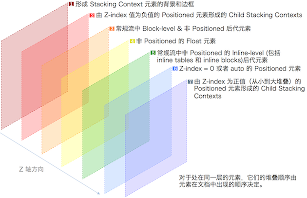
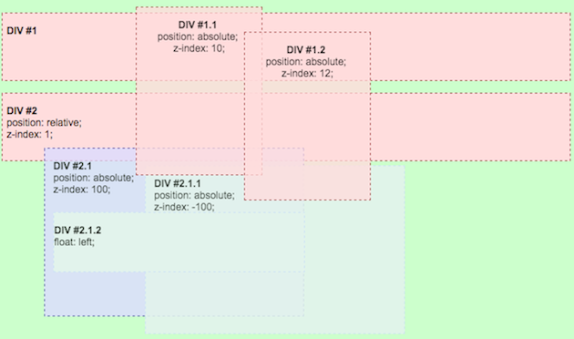

在正式开始介绍前，我们先提出这样一个疑问：

> 当两个元素位置互相堆叠在一起时，CSS 样式是如何决定哪个元素显示在前，哪个元素显示在后的呢？

为了解决这个问题，在左右、上下的布局基础上，CSS 2.1 引入了第三维度`Z 轴`的概念。CSS 将所有元素都被纳入一个`Stacking Context`中，根据某种规则控制元素堆叠的优先顺序，下面主要详细介绍一下这种规则。

## Stacking Context 介绍

CSS 2.1 Spec 对`Stacking Context`的描述：
> The order in which the rendering tree is painted onto the canvas is described in terms of stacking contexts.

我对这句话的理解是：`Stacking Context`有着一套规范元素堆叠顺序的规则。在渲染页面时，根据这套顺序规则依次在 Z 轴上显示不同元素。

### Stacking Context 的特性

   * 每个文档布局中存在多个 `Stacking Context`。而产生一个新的 `Stacking Context` 是有条件的「详见下文」
   * 在每个`Stacking Context`中可以嵌套其它的`Stacking Context`
   * 每个`Stacking Context`中的元素位置和同级的`Stacking Context`中元素位置的顺序是互相独立的
   * 每个`Stacking Context`是自包含的，即当父元素形成一个`Stacking Context`「此时作为后代元素的`Parent Stacking Context`」，所有内部后代元素的堆叠顺序都仅限在`Parent Stacking Context`比较

### Stacking Context 内部元素排列顺序规则
按抵部->顶部顺序，可以抽象成七层布局：

### 归属于不同 Stacking Context 的元素顺序比较
上面介绍的堆叠顺序规则只用于比较同属于一个`Parent Stacking Context`的元素堆叠顺序。如果两个元素属于两个不同的`Parent Stacking Context`，那么它俩的顺序是由`Parent Stacking Context`的顺序决定的。

这句话说的有点绕，我们用图例来解释：

从图例中可以看到，`DIV #2.1 `元素位置在` DIV #1.1 `和` DIV #1.2 `之下，尽管它的` z-index `值为 100。产生这个现象的原因就是因为` DIV #2.1 `和` DIV #1.1 `不在同一个`Parent Stacking Context`。所以此时需要找到` DIV #2.1 `的`Parent Stacking Context`，即为` DIV #2`，此时比较` DIV #2 `和` DIV #1.1 `的堆叠顺序，因为` DIV #2 `的`z-index`值为 1，所以它在` DIV #1.1 `元素的下方，同时` DIV #2.1 `的位置顺序受限于` DIV #2`，最后的排布顺序就如图所示。

> **图例解释说明：**

> * DIV #n，#n.n，#n.n.n 表示互为父-子元素关系，具体`HTML`结构层次：

> >  * Body
> >    * DIV #1
> >  	  * DIV #1.1
> >   	  * DIV #1.2
> >    * DIV #2
> >    	  * DIV #2.1
> >   		 * DIV #2.1.1
> >    		 * DIV #2.1.2

> * 绿色背景表示根元素「即`<html>`」产生的`Stacking Context`
> * 颜色相同的元素表示它们同属于一个`Parent Stacking Context`，`Stacking Context`层次关系：

> >  * Root
> >  	 * DIV #1
> >  	 * DIV #1.1
> >  	 * DIV #1.2 
> >  	 * DIV #2
> >  		* DIV #2.1
> >  			* DIV 2.1.1
> >  			* DIV 2.1.2

既然元素处于哪个` Parent Stacking Context `也会影响元素显示顺序，那么我们来看看元素的` Parent Stacking Context `是如何产生的：

> 最外层的` Stacking Context `是根元素产生的，那么我们可以理解为它是所有元素的` Parent Stacking Context`。但当有新的` Stacking Context `产生时，这个新` Stacking Context `就是所有后代元素的` Parent Stacking Context`。以此类推，每当父元素产生一个新` Stacking Context`，就给后代元素提供了一个` Parent Stacking Context`。

### 产生新 Stacking Context 的条件

   * `Root element`「可以理解为第一个` Stacking Context`，用来包含其它的` Stacking Context`」
   * `Positioned `元素的` z-index `值不是` auto`
   * 元素的` Opacity `值小于 1「可以看作是给普通元素增加了` Position `属性，且` z-index `值为 0「详细可见 [CSS Spec 2.1](http://www.w3.org/TR/css3-color/#transparency)」
   * Chrome 22+ 和 Mobile WebKit,` z-index `值为` auto `的` fixed position`元素

## Positioned 元素堆叠顺序规则
上面介绍了每一个` Stacking Context `内部元素的堆叠顺序，这里进一步详细介绍` Positioned `元素的堆叠顺序。

### z-index 的作用
`Positioned `元素的堆叠顺序是由` z-index `决定的。`z-index `有2个作用：

1. 决定` Positioned `元素的` Stack Level `「可以理解为堆叠优先级，`Stack Level `值为整数，值大的放在上层」
2. 决定是否形成一个新的` Stacking Context`

### z-index 属性值

`z-index` 有两个属性值：`<integer>`和`<auto>`「注：只有` Positioned `元素的` Z-index `值才有效」。

* `<integer>`：当` Z-index `设置了一个整数「负整数，零，正整数」时，`Positioned `元素就产生了一个新的` Stacking Context`，同时这个整数代表了当前元素的` Stack Level`
* `<auto>`：该值说明当前元素的` Stack Level `值为 0。但此时并没有产生新的` Stacking Context`，除非这个元素是个根元素「注：这里可以看出` z-index = auto `和` z-index = 0`的区别」

## 总结
1. 任意一个元素都归属一个` Stacking Context`，`Stacking Context `可以互相嵌套，从而形成一个` Stacking Context `层级体系。「`Root element `是一个初始的` Stacking Context`，它包裹了其它的` Stacking Context`」
2. 在每一个` Stacking Context `内部，有特定堆叠优先级规则决定不同类型元素的堆叠顺序「`Positioned `元素的堆叠顺序由` z-index `值决定」
3. 当两个元素归属于不同的` Parent Stacking Context `时，它们的堆叠顺序互不干扰

### 参考资料

  1. http://www.w3.org/TR/CSS21/zindex.html
  2. http://www.w3.org/TR/CSS21/visuren.html#layers
  3. http://www.w3.org/TR/css3-color/#transparency
  4. http://segmentfault.com/a/1190000000460664
  5. http://gbspacing.com/z-index.gb
  6. https://developer.mozilla.org/en-US/docs/Web/Guide/CSS/Understanding_z_index
